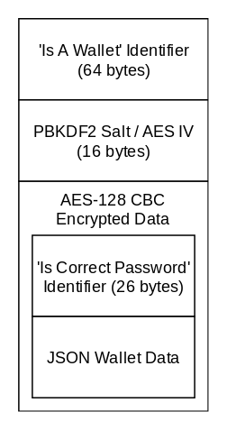

# Wallet File Interaction

This document sets out the format of wallet files used by the TurtleCoin software, how to open them, save them, and the format of the JSON contained within them.

Code examples to open wallet files are given in the subdirectories - A few common languages have been included. So far, there are implementations in:

* [C++](https://github.com/turtlecoin/wallet-file-interaction/tree/master/cpp)
* [C#](https://github.com/turtlecoin/wallet-file-interaction/tree/master/C%23)

If you implement opening a wallet in your language of choice, please send a pull request to help out other users!

Note that this document only applies to wallets using 'WalletBackend', not wallet using 'WalletGreen'.

For your convenience, a brand new, empty wallet is included - [test.wallet](test.wallet). It is using the password, `password`.

## Opening a wallet file



Start by loading the wallet file into a byte / unsigned char array.

Next, you need to verify that this file is a wallet file.

If it is a wallet file, it will begin with the following 'Is A Wallet File' identifier:

```
0x49, 0x66, 0x20, 0x49, 0x20, 0x70, 0x75, 0x6c, 0x6c, 0x20, 0x74,
0x68, 0x61, 0x74, 0x20, 0x6f, 0x66, 0x66, 0x2c, 0x20, 0x77, 0x69,
0x6c, 0x6c, 0x20, 0x79, 0x6f, 0x75, 0x20, 0x64, 0x69, 0x65, 0x3f,
0x0a, 0x49, 0x74, 0x20, 0x77, 0x6f, 0x75, 0x6c, 0x64, 0x20, 0x62,
0x65, 0x20, 0x65, 0x78, 0x74, 0x72, 0x65, 0x6d, 0x65, 0x6c, 0x79,
0x20, 0x70, 0x61, 0x69, 0x6e, 0x66, 0x75, 0x6c, 0x2e
```

If these bytes are not present, the wallet file is not valid.

If they are present, remove them from the data you are processing, and continue.

Next, we need to read in the *salt*. The *salt* is 16 random bytes that are generated on each save, to prevent multiple saves with the same password leaking data.

Simply read in the following 16 bytes into a salt array.

Remove them from the data you are processing, and continue.

Now we need to hash the wallet password, which the user should have provided you.

Start by hashing the password with *PBKDF2*, also known as *RFC2898*. We use *500,000* iterations of PBKDF2, using the SHA256 algorithm, and the salt we extracted earlier.

Once you have got the hashed password, we can use this as the AES key to decrypt the data.

The AES parameters are as follows:

* AES key size - 16 bytes / 128 bits
* AES block size - 16 bytes / 128 bits
* AES Mode - CBC
* AES padding Mode - PKCS#7 (Also known as RFC 5652)

For the AES *key*, we use the first 16 bytes of the hashed password.
For the AES *IV*, we use the same *salt* we used earlier.

Apply the AES decryption with the given parameters to the data.

Note that if the wrong password is supplied, it is likely your AES decryption will throw, with an error about 'Invalid padding'. This is expected.

It is possible an 'Invalid padding' error is not thrown, with an invalid password, occasionaly. For this we have an additional magic identifier we can check the presence of.

The unencrypted data should now begin with the following 'Is Correct Password' identifier:

```
0x59, 0x6f, 0x75, 0x27, 0x72, 0x65, 0x20, 0x61, 0x20, 0x62, 0x69,
0x67, 0x20, 0x67, 0x75, 0x79, 0x2e, 0x0a, 0x46, 0x6f, 0x72, 0x20,
0x79, 0x6f, 0x75, 0x2e
```

If it does, remove this identifier, and you should be left with the JSON data.

If it does not, the password is incorrect.

## Saving a wallet file

To save a wallet file, we essentially do the same process as detailed above, in reverse.

Convert any data you store to the JSON format we will detail later. Prepend the 'Is Correct Password' identifier to this.

Generate 16 random bytes, which will be used for the salt.

Hash the users password with PBKDF2, using the same parameters as before, and the salt you just generated. Make sure to generate a new salt on each save.

Next, encrypt the identifer + JSON data with AES. The AES parameters are exactly the same as before, again using the salt we just generated, and the hashed password.

Write the 'Is A Wallet' identifier to the file. Then, write the salt to the file. Finally, write the encrypted JSON to the file.

## The JSON Schema

TODO
